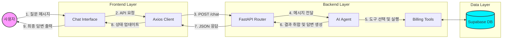
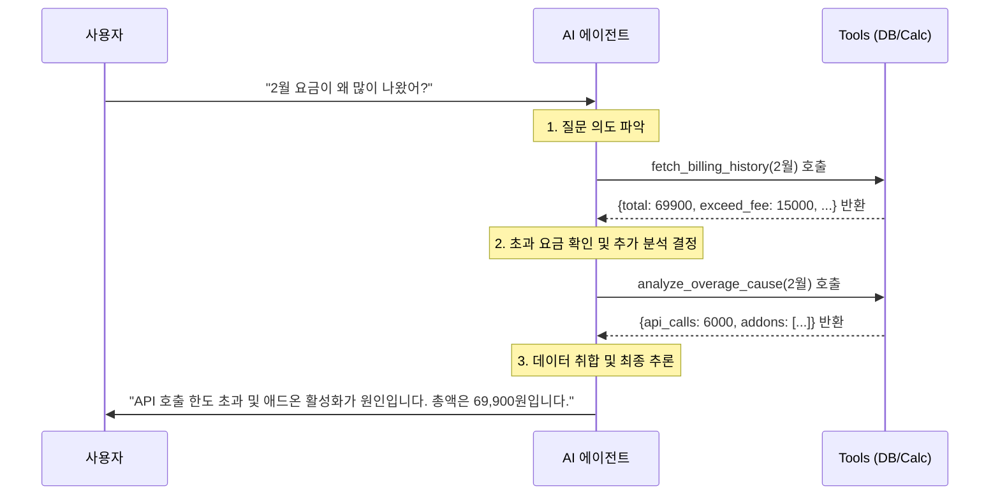
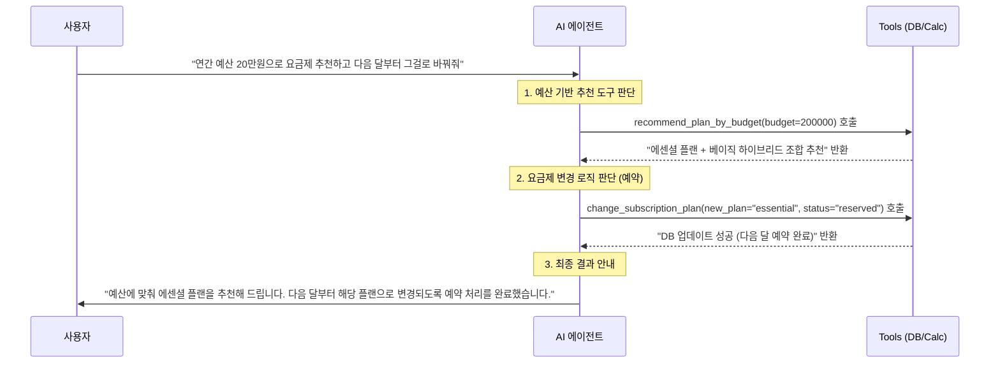

# 요금 안내 AI 데모

> **LangGraph**, **FastAPI**, 그리고 **React**를 사용하여 구축된 **지능형 요금 분석 및 안내 AI 에이전트** 서비스입니다. 단순히 요금제를 안내하는 것을 넘어, 사용자의 실제 청구 내역(Supabase DB)을 실시간으로 조회하고 **요금 초과 발생 원인(API 사용량, 부가서비스 가입 등)을 스스로 추론**하여 데이터 기반의 맞춤형 상담을 제공합니다.

---

## 🔄 시스템 아키텍처 및 서비스 플로우

### 1. 전체 시스템 흐름

사용자의 질문이 프론트엔드에서 백엔드로 전달되어 AI 에이전트가 도구를 선택하고 답변하는 전체 흐름입니다.



### 2. 에이전트 추론 프로세스 (ReAct Pattern)

AI 에이전트가 판단하고 여러 도구를 실행하는 내부 로직입니다. 최근 추가된 **맞춤 요금제 추천** 및 **실시간 요금제 예약/변경** 기능까지 포함된 다양한 플로우를 완벽하게 지원합니다.

**✅ 시나리오 A: 요금 상세 분석 프로세스**



**✅ 시나리오 B: 맞춤 추천 및 원격 구독 변경 프로세스**



### 3. LangGraph 기반 요금 Agent 워크플로우 분석

현재 Agent 아키텍처는 **ReAct(Reasoning and Acting) 패턴**을 완벽하게 구현하고 있으며, 유연성과 안정성(메모리 체크포인트)을 모두 확보한 상태입니다.

- **Reasoning (생각 및 판단):** LLM(`billing_assistant` 노드)이 사용자의 질문을 분석하고, 어떤 도구를 조합해 문제를 해결할지 스스로 계획합니다.
- **Routing (조건부 분기):** `should_use_tool` 함수를 통해 도구 사용이 필요하면 `tool_executor` 노드로 라우팅하고, 최종 답변이 완성되면 루프를 종료합니다.
- **Acting (도구 실행):** LLM이 요청한 도구를 실행(`tool_executor`)하고 그 결과를 상태 메모리에 저장합니다. 결과는 다시 에이전트에게 전달되어 재차 판단(Reasoning)에 사용됩니다.

### 4. 세부 도구 (Custom Tools) 설계 현황

Agent가 활용하는 도구들은 역할에 따라 기능적으로 완전히 분리되어 설계되었습니다. 이를 통해 LLM의 환각을 제어하고, 정확한 데이터 기반의 상담을 제공합니다.

| 도구명 (함수명)                                 | 아키텍처 분류                                                             | 핵심 역할                                                                |
| :---------------------------------------------- | :------------------------------------------------------------------------ | :----------------------------------------------------------------------- |
| `calculate_billing,`recommend_plan_by_budget  | **Business Logic / Calculation Tools** (비즈니스 로직 및 계산 도구) | 내부 연산, 단가 정책 반영, 환각 방지 및 맞춤형 플랜 추천                 |
| `fetch_billing_history,`analyze_overage_cause | **Data Retrieval**(데이터 검색 도구)                                | 외부 데이터 연동(Supabase DB), 사실 기반의 요금 청구 및 로그 데이터 검색 |
| `change_subscription_plan`                    | **Action / State Mutation Tools** (상태 변경 및 실행 도구)          | 실질적인 데이터 변화(월별 연계 상태 업데이트) 생성 및 DB 반영            |

### 5. Pydantic 기반의 데이터 검증 (Data Validation)

LangGraph 기반의 AI 에이전트 시스템에서 LLM(대규모 언어 모델)의 출력은 본질적으로 비정형 텍스트이므로 100% 신뢰할 수 없습니다. 따라서 본 프로젝트는 **Pydantic을 활용하여 시스템 전체의 안정성을 보장**하고 있습니다.

- **AI 도구(Tool) 입력값 검증**: `@tool(args_schema=...)` 데코레이터를 사용하여 LLM이 도구(함수)를 호출할 때 전달하는 인자(Arguments)의 타입과 형태를 엄격하게 제한합니다. LLM에게 필드 설명을 명시(예: `budget: int = Field(...)`)하여 올바른 형식의 추론을 유도하고, 잘못된 타입의 데이터를 사전에 차단합니다.
- **API 규격 검증 (FastAPI)**: 프론트엔드와 통신하는 API 요청/응답 시에도 `BaseModel`을 상속한 스키마(예: `ChatRequest`)를 정의합니다. 이를 통해 올바른 형식의 요청만 백엔드 로직에 도달하도록 하며, API 명세서(Swagger UI)를 자동 생성하는 이점도 확보했습니다.

### 6. LLM-as-a-Judge 기반 평가 자동화 (DeepEval)

에이전트 답변의 품질을 지속적으로 관리하기 위해 **DeepEval 프레임워크**를 도입하여 `LLM-as-a-Judge` 평가 파이프라인(`backend/eval/run_eval.py`)을 구축했습니다.
평가 데이터셋은 Supabase의 `evaluation_dataset` 테이블에서 중앙 관리하며, 다음과 같은 5개의 다면적인 커스텀 지표(GEval)를 기준으로 채점하여 가중치 100점 만점으로 환산합니다.

- **정합성 (Groundedness, 25%)**: 환각 없이 주어진 검색 컨텍스트(기술문서, DB조회결과) 내에서만 답변했는가
- **증거가능성 (Evidenceability, 15%)**: 답변이 컨텍스트의 구체적인 수치/섹션을 명시적으로 참조하는가
- **명확성 (Clarity, 10%)**: 모호한 대명사를 피하고 답변 범위가 분명한가
- **원자성 (Atomicity, 10%)**: 불필요한 부연 설명 없이 사용자가 요구한 단일 과업에만 집중했는가
- **의미강건성 (Semantic Robustness, 5%)**: 단순 키워드 매칭이 아닌 사용자 질문의 숨은 의도를 파악했는가

> *평가 로직 최적화*: Google Gemini의 `2.5-flash` 모델을 평가자(Judge)로 지정하고 API Rate Limit 방어 로직(비동기 대기 및 재시도)을 적용하였으며, `rich` 라이브러리로 터미널 프로그래스 바 및 결과 테이블 UI를 제공합니다.

---

## 📂 프로젝트 구조 (Project Structure)

전체 프로젝트는 크게 백엔드(Python), 프론트엔드(React), 그리고 인프라 설정으로 구성되어 있습니다.

```text

├── backend/               # 에이전트 로직 및 API 서버 (FastAPI + LangGraph)
│   ├── eval/              # LLM-as-a-Judge 평가 파이프라인 (DeepEval)
│   │   ├── eval_metrics.py # 커스텀 평가 지표(GEval) 정의
│   │   └── run_eval.py    # 평가 실행 및 결과 스크립트
│   ├── main.py            # 핵심 AI 로직 및 엔드포인트
│   └── README.md          # 백엔드 상세 기술 문서
├── frontend/              # 사용자 인터페이스 (React + Vite)
│   ├── src/               # React 컴포넌트 및 UI 로직
│   ├── Dockerfile.dev     # 실시간 코드 반영(HMR) 개발용 설정
│   └── README.md          # 프론트엔드 상세 가이드
├── Dockerfile.backend     # 백엔드 컨테이너 빌드 설정
├── docker-compose.yml     # 백엔드-프론트엔드 통합 운영 설정
├── pyproject.toml         # Python 프로젝트 설정 및 의존성 (uv)
└── run.sh                 # 로컬 환경 통합 실행용 스크립트
```

---

## 🐳 Docker 설정

> Docker Compose를 사용하면 별도의 로컬 설정 없이 전체 서비스를 일괄적으로 실행할 수 있습니다.

### 1. Docker 환경 준비

> 처음 Docker를 사용하는 경우, 아래 명령어로 필요한 툴을 설치하고 권한을 설정하세요.

```bash
# Docker 및 Compose 설치 (Ubuntu/WSL)
sudo apt-get update && sudo apt-get install -y docker-ce docker-ce-cli containerd.io docker-compose-plugin

# 1. 권한 영구 설정 (sudo 없이 사용)
sudo usermod -aG docker $USER
newgrp docker  # 현재 터미널에 즉시 반영 (또는 WSL 재시작)

# 2. 서비스 시작
sudo service docker start
```

### 2. WSL2 Docker 자동 시작 설정 (선택 사항)

WSL2 환경에서는 시스템 시작 시 Docker가 자동으로 켜지지 않을 수 있습니다. 쉘 설정 파일(`~/.zshrc` 또는 `~/.bashrc`) 맨 하단에 아래 코드를 추가하면 터미널 실행 시 자동으로 Docker를 확인하고 실행합니다.

```bash
# ~/.zshrc 또는 ~/.bashrc 하단에 추가
if ! service docker status > /dev/null 2>&1; then
    echo "🐳 Starting Docker service..."
    sudo service docker start
fi
```

### 2. 빌드 및 실행

```bash
docker compose build   # 이미지 빌드
docker compose up -d    # 백그라운드 실행
```

### 3. 상태 및 실시간 로그 확인

```bash
docker compose ps               # 실행 컨테이너 확인
docker compose logs -f          # 전체 실시간 로그
docker compose logs -f server   # 백엔드 로그만 계속 보기
```

### 4. 코드 수정 및 실시간 반영

* **백엔드**: `backend/main.py` 파일 하단의 `reload=True` 설정과 볼륨 마운트 덕분에 코드 수정 시 **자동으로 재시작**됩니다.
* **프론트엔드**: `frontend/Dockerfile.dev`를 사용하여 Vite 개발 서버가 실행 중입니다. 소스 코드를 수정하면 **HMR(Hot Module Replacement)**을 통해 브라우저에 즉시 반영됩니다.

  * *참고: 기존 `frontend/Dockerfile`은 Nginx 기반의 배포용 설정이며, 현재는 실시간 수정을 위해 `Dockerfile.dev`를 사용하도록 설정되어 있습니다.*
* docker 서비스 시작:

```bash
sudo service docker start
```

* 권한 문제 발생시 소켓 권한 설정

```bash
sudo chmod 666 /var/run/docker.sock
```

* 재시작이 필요한 경우:

```bash
docker compose restart          # 전체 재시작
docker compose restart server   # 백엔드 재시작
docker compose restart client   # 프론트엔드 재시작
```

* 일시정지 필요한 경우:

```bash
docker compose pause          # 전체 일시정지
docker compose pause server   # 백엔드 일시정지
docker compose pause client   # 프론트엔드 일시정지
```

* 일시정지 해제 필요한 경우:

```bash
docker compose unpause          # 전체 일시정지 해제
docker compose unpause server   # 백엔드 일시정지 해제
docker compose unpause client   # 프론트엔드 일시정지 해제
```

* 중지 필요한 경우:

```bash
docker compose stop          # 전체 중지
docker compose stop server   # 백엔드 중지
docker compose stop client   # 프론트엔드 중지
```

* 재시작 필요한 경우:

```bash
docker compose start          # 전체 재시작
docker compose start server   # 백엔드 재시작
docker compose start client   # 프론트엔드 재시작
```

### 5. 불필요 도커 이미지 삭제

```bash
docker rmi ID # 예시: docker rmi b75a6bc59bf1
```

### 6. 테스트 경로

* **프론트엔드**: [Web](http://172.25.231.60:5173/)
* **백엔드 API**: [FastAPI - Swagger UI](http://172.25.231.60:8000/docs#/default/health_check_health_get)

---

## 로컬 개발 가이드

개발 중 실시간 코드 반영(HMR)을 원하시면 로컬 환경에서 실행하는 것이 좋습니다.

### 통합 실행 (Script)

터미널 창 하나에서 백엔드와 프론트엔드를 동시에 띄웁니다.

```bash
chmod +x run.sh
./run.sh
```

### 개별 실행 (Manual)

#### ⚙️ Backend (Python/FastAPI)

```bash
# 프로젝트 루트에서 실행
uv sync                # 의존성 설치
uv run python backend/main.py
```

👉 상세 내용은 [backend/README.md](./backend/README.md) 참고

#### 🎨 Frontend (React/Vite)

```bash
cd frontend
npm install            # 패키지 설치
npm run dev
```

👉 상세 내용은 [frontend/README.md](./frontend/README.md) 참고

---

## 주요 기능 (Core Features)

- **AI 상담 에이전트**: LangGraph ReAct 패턴을 사용한 지능형 도구 선택
- ** 요금 자동 계산**: `calculate_billing` 도구로 복수 플랜 사용 시 합계 산출
- ** 예산 맞춤 추천**: `recommend_plan_by_budget` 도구로 최적 요금제 제안
- ** 데이터 기반 조회 및 분석**: Supabase DB와 연동하여 청구 상세 내역과 초과 사유 로그 분석 (`fetch_billing_history`, `analyze_overage_cause`)
- ** 액션 및 상태 변경 (Mutation)**: 사용자의 요청에 따라 즉시 또는 지정된 월부터 구독 요금제를 변경 및 예약하고 변경 이력을 DB에 관리 (`change_subscription_plan`)
- **실시간 채팅 UI**: Framer Motion 애니메이션이 적용된 UI/UX

---

## 🛠 기술 스택 (Tech Stack)

| 계층 (Layer)            | 세부 기술 (Technologies)                                      | 
| :---------------------- | :---------------------------------------------------------- |
| **Model**               | Google Gemini 2.5 Flash/ gemini-3-flash-preview                         |
| **Orchestration**       | LangChain, LangGraph (ReAct Pattern, MemorySaver)           |
| **Backend**             | Python 3.12, FastAPI, Uvicorn, Pydantic                     |
| **Frontend**            | React 18, Vite, Tailwind CSS v4, Framer Motion              |
| **Database**            | Supabase (PostgreSQL - `billing_history`, `evaluation_dataset`) |
| **Eval (LLM-as-a-Judge)**| DeepEval                                     |
| **DevOps & Package**    | Docker, Docker Compose, uv (Python), npm (Node)             |

---

## 🔌 API 명세 요약 (API Usage)

### POST `/chat`

사용자의 질문을 처리하고 대화 이력을 반환합니다.

**Request:**

```json
{
  "message": "프로 요금제 3개월 가격 얼마야?",
  "thread_id": "user_session_1"
}
```

**Response:**

```json
[
  { "role": "user", "content": "프로 요금제 3개월 가격 얼마야?" },
  { "role": "assistant", "content": "프로 요금제는 월 29,900원이며, 3개월 총액은 89,700원입니다." }
]
```

---

## 🗄️ 데이터베이스 스키마

**Supabase 테이블: `billing_history`**

| 컬럼                  | 타입            | 설명                                                         |
| :-------------------- | :-------------- | :----------------------------------------------------------- |
| `user_id`           | `text`        | 사용자 식별 (예: user_123)                                   |
| `billing_month`     | `text`        | 청구 달 (예: 2026-02)                                        |
| `details`           | `jsonb`       | 요금 상세 (total, base_fee, discount 등)                     |
| `subscription_info` | `jsonb`       | 구독 상태(current_plan 등) 및 변경 이력(change_history) 정보 |
| `created_at`        | `timestamptz` | 데이터 생성 일시                                             |

<br>

**Supabase 테이블: `evaluation_dataset` (LLM 평가용)**

| 컬럼 | 타입 | 설명 |
| :--- | :--- | :--- |
| `id` | `uuid` (PK) | 평가 데이터 세트 고유 식별자 |
| `question` | `text` | 평가에 사용되는 질문 (사용자 발화 모사) |
| `expected_answer` | `text` | 정답 및 모범 가이드라인 (Robustness 검증용) |
| `topic_path` | `jsonb` | 안내 카테고리 계층 구조 (예: `요금 > 모바일...`) |
| `context_references` | `jsonb` | 필수 참조 문서 혹은 도구명 (Groundedness 검증용) |
| `intent_type` | `text` | 사용자의 핵심 질문 의도명 (Factoid, Compare 등) |
| `created_at` | `timestamptz` | 역대 평가 내역 생성 일시 |

---

## 💡 참고: 프론트엔드 모드 전환 (Development vs Production)

현재 `docker-compose.yml`은 실시간 코드 수정을 위해 **개발 모드**로 설정되어 있습니다. 상황에 따라 아래와 같이 설정을 변경할 수 있습니다.

### 1. 개발 모드 (기본값)

- **특징**: 코드 수정 시 즉시 반영(HMR), Vite 개발 서버 사용
- **설정**:
  - `dockerfile: Dockerfile.dev`
  - `ports: - "5173:5173"`
  - `volumes: - ./frontend:/app` 활성화

### 2. 프로덕션 모드 (배포 테스트용)

- **특징**: 빌드된 정적 파일을 Nginx가 서빙, 보안 및 성능 최적화 상태 확인 가능
- **설정 변경 방법**:
  1. `docker-compose.yml`에서 `dockerfile: Dockerfile.dev`를 주석 처리하고 `dockerfile: Dockerfile` 주석을 해제합니다.
  2. `ports` 설정을 `5173:80`으로 변경합니다.
  3. `volumes` 설정을 주석 처리합니다 (빌드된 이미지를 사용하므로).
  4. `docker compose up -d --build` 명령어로 재빌드 및 실행합니다.

---

## 🚀 클라우드 서비스 배포 (Deployment)

이 프로젝트는 프론트엔드와 백엔드를 각각 분리하여 최신 클라우드 플랫폼에 배포할 수 있습니다.

### 1. 백엔드 배포 (Render.com)

백엔드는 Docker 환경 지원이 우수한 **Render**를 사용하여 무료로 배포할 수 있습니다.

1. **Render**에 가입 후 **"New Web Service"**를 생성합니다.
2. GitHub Repository를 연동합니다.
3. 설정값을 다음과 같이 지정합니다:
   - **Environment**: `Docker`
   - **Root Directory**: `.` (루트 디렉토리 유지)
   - **Dockerfile Path**: `./Dockerfile.backend`
   - **Environment Variables**: 로컬 `.env`에 정의된 변수들을 모두 입력 (예: `GEMINI_API_KEY`, `SUPABASE_URL` 등)
4. 배포가 완료되면 `https://your-service-name.onrender.com` 과 같은 URL이 발급됩니다.

### 2. 프론트엔드 배포 (Vercel)

프론트엔드는 React/Vite 호스팅에 최적화된 **Vercel**을 사용하여 빠르고 쉽게 배포합니다.

1. **Vercel**에 가입 후 **"Add New Project"**를 클릭하여 GitHub Repository를 가져옵니다.
2. 설정값을 다음과 같이 지정합니다:
   - **Framework Preset**: `Vite` (자동 감지됨)
   - **Root Directory**: `frontend`
3. **Environment Variables**에 다음을 추가합니다:
   - **Key**: `VITE_API_URL`
   - **Value**: Render에서 발급받은 백엔드 URL (`https://your-service-name.onrender.com`)
4. **Deploy** 버튼을 클릭합니다.
5. 배포가 완료되면 글로벌 엣지 네트워크에서 서비스되는 프론트엔드 주소를 얻을 수 있습니다. 백엔드 주소가 변경된 경우 Vercel 환경 변수를 수정한 뒤 **Redeploy**만 진행하면 됩니다.
